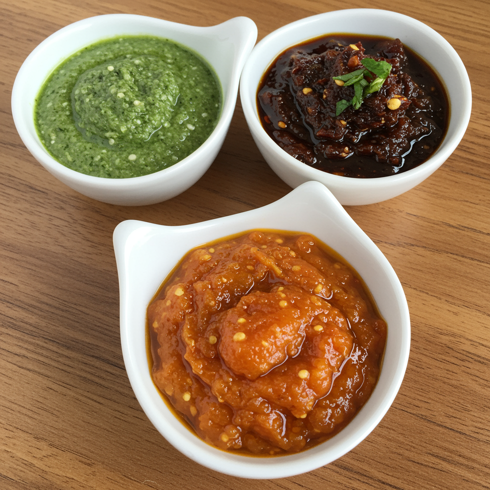

# Chutneys 

Chutneys sind eine wichtige Komponente der indischen Küche und werden oft als Beilage zu verschiedenen Gerichten serviert. Sie können frisch, gekocht oder eingelegt sein und reichen von süß über sauer bis scharf. Hier sind typische indische Chutneys, die häufig in Restaurants serviert werden.

Die Saucen sind typische indische Chutneys, die in kleinen Schälchen serviert werden:

1.  **Die grüne Sauce:**
    *   **Name:** **Minze-Koriander-Chutney** (Pudina Chutney / Dhaniya Chutney)
    *   **Zubereitung:** Frische Minzblätter, Korianderblätter, grüne Chilis (für Schärfe), Ingwer, Knoblauch (optional), Zitronen- oder Limettensaft, Kreuzkümmelpulver, Kala Namak (schwarzes Salz) werden mit etwas Wasser zu einer glatten Paste püriert. Es ist frisch, würzig und kann je nach Menge der Chilis auch sehr scharf sein.

2.  **Die dunkelbraune Sauce:**
    *   **Name:** **Tamarinden-Chutney** (Imli Chutney)
    *   **Zubereitung:** Tamarindenmark wird eingeweicht und püriert, dann mit Jaggery (Rohrzucker) oder braunem Zucker, Kreuzkümmelpulver, Chilipulver, Ingwerpulver und Salz gekocht, bis es eindickt. Es ist hauptsächlich süß-sauer, mit einer leichten Würze.

3.  **Die orange/gelbe, scharfe Sauce:**
    *   **Name:** Angesichts der Schärfe und Farbe ist dies sehr wahrscheinlich ein **Scharfes Knoblauch-Chutney** (auch **Lehsun Chutney** genannt) oder ein **Scharfes Chili-Knoblauch-Chutney**. Manchmal kann es auch ein **Scharfes Ingwer-Chili-Chutney** sein.
    *   **Zubereitung (Scharfes Knoblauch-Chutney):** Dies wird oft aus getrockneten roten Chilis (die nach dem Einweichen und Pürieren eine leuchtende orange-gelbe Farbe annehmen können, besonders wenn Kurkuma hinzugefügt wird), einer großen Menge Knoblauch, Kreuzkümmel, Salz und manchmal etwas Öl oder Tamarindenmark für eine leichte Säure hergestellt. Alle Zutaten werden zu einer relativ glatten Paste püriert. Die Schärfe kommt primär von den roten Chilis. Es ist ein sehr beliebtes, feuriges Chutney, besonders im Westen Indiens.
    *   **Variante (Scharfes Ingwer-Chili-Chutney):** Hierbei werden frische Ingwerstücke, grüne oder rote Chilis, Knoblauch, Zitronensaft oder Essig und Salz püriert.

Diese Chutneys sind eine fantastische Ergänzung zu vielen indischen Gerichten und bieten eine aufregende Geschmacksvielfalt!
