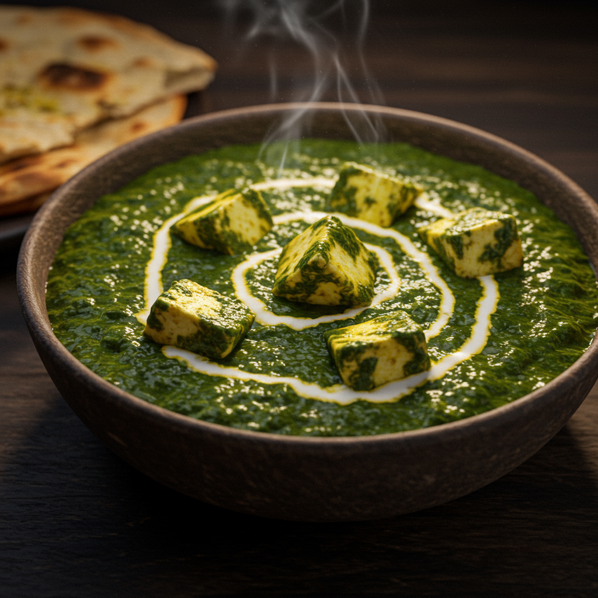

# Palak Paneer

(Cremiger Spinat mit indischem Frischkäse)

- [Palak Paneer](#palak-paneer)
  - [Zutaten](#zutaten)
  - [Zubereitung](#zubereitung)
  - [Tipps und Variationen](#tipps-und-variationen)
  - [Serviervorschlag](#serviervorschlag)

Dieses Rezept zeigt dir, wie du ein Palak Paneer zubereitest, das so gut schmeckt wie im Restaurant – mit einer leuchtend grünen Farbe und einem tiefen, würzigen Aroma.

- **Vorbereitungszeit:** 20 Minuten
- **Kochzeit:** 30 Minuten
- **Portionen:** 3-4 Personen

---

## Zutaten

**Für den Spinat:**

- **500 g frischer Spinat** (oder ca. 300 g gefrorener Blattspinat)
- Wasser zum Kochen
- Eine große Schüssel mit Eiswasser

**Für das Paneer:**

- **250 g Paneer** (indischer Frischkäse), in ca. 2 cm große Würfel geschnitten
- **1 EL Ghee** oder Pflanzenöl zum Anbraten (optional)

**Für die Masala (Saucenbasis):**

- **2 EL Ghee** (geklärte Butter) oder Pflanzenöl
- **1 TL Kreuzkümmelsamen** (ganz)
- **1 große Zwiebel**, fein gehackt
- **1 EL Ingwer-Knoblauch-Paste** (oder 2 cm frischer Ingwer und 3-4 Knoblauchzehen, fein gerieben/gehackt)
- **1-2 grüne Chilischoten**, fein gehackt (je nach gewünschter Schärfe, optional)
- **2 mittelgroße Tomaten**, püriert oder sehr fein gehackt
- **1/2 TL Kurkumapulver**
- **1 TL Korianderpulver**
- **1/2 TL Garam Masala**
- **Salz** nach Geschmack

**Zum Verfeinern:**

- **3-4 EL Sahne** (oder Cashew-Creme für eine vegane/reichhaltigere Variante)
- **1 TL Kasuri Methi** (getrocknete Bockshornkleeblätter), zwischen den Fingern zerrieben (optional, aber sehr empfohlen für authentischen Geschmack)
- **1 EL Zitronensaft**, frisch gepresst

---

## Zubereitung

**Schritt 1: Spinat vorbereiten (Blanchieren)**

1. Den frischen Spinat gründlich waschen.
2. Einen großen Topf mit Wasser zum Kochen bringen. Den Spinat hineingeben und nur **1-2 Minuten** kochen lassen, bis er zusammenfällt.
3. Den Spinat sofort mit einer Schaumkelle aus dem kochenden Wasser heben und direkt in die Schüssel mit Eiswasser geben. Dieser Schritt stoppt den Garprozess und sorgt dafür, dass der Spinat seine leuchtend grüne Farbe behält.
4. Nach einer Minute im Eiswasser den Spinat gut abtropfen lassen und das überschüssige Wasser vorsichtig mit den Händen ausdrücken.
5. Den blanchierten Spinat in einem Mixer oder mit einem Pürierstab zu einer glatten oder leicht stückigen Paste verarbeiten. Zur Seite stellen.

*(Bei gefrorenem Spinat: Auftauen lassen, überschüssiges Wasser gut ausdrücken und dann pürieren.)*

**Schritt 2: Paneer vorbereiten (optional, aber empfohlen)**

1. In einer Pfanne 1 EL Ghee oder Öl erhitzen.
2. Die Paneer-Würfel darin bei mittlerer Hitze von allen Seiten goldbraun anbraten. Das gibt ihm eine tolle Textur und verhindert, dass er im Curry zerfällt.
3. Die angebratenen Würfel aus der Pfanne nehmen und zur Seite stellen.

**Schritt 3: Die Masala (Saucenbasis) zubereiten**

1. In derselben Pfanne (oder einem Topf) 2 EL Ghee erhitzen.
2. Die Kreuzkümmelsamen hinzufügen und warten, bis sie anfangen zu knistern und zu duften.
3. Die fein gehackte Zwiebel dazugeben und bei mittlerer Hitze glasig bis leicht goldbraun anbraten (ca. 5-7 Minuten).
4. Ingwer-Knoblauch-Paste und grüne Chilis hinzufügen und ca. 1 Minute mitbraten, bis der rohe Geruch verschwunden ist.
5. Die pürierten Tomaten hinzufügen und alles gut vermischen. Jetzt die Gewürze dazugeben: Kurkuma und Korianderpulver. Mit Salz würzen.
6. Die Mischung köcheln lassen, bis die Tomaten eingedickt sind und sich das Öl an den Rändern der Pfanne zu lösen beginnt (ca. 5-8 Minuten). Das ist ein Zeichen, dass die Basis fertig ist.

**Schritt 4: Alles zusammenführen**

1. Das Spinatpüree in die Pfanne zur Masala geben und alles gut vermengen.
2. Je nach gewünschter Konsistenz etwas Wasser (ca. 100 ml) hinzufügen. Das Curry für 5-7 Minuten bei schwacher Hitze köcheln lassen, damit sich die Aromen verbinden.

**Schritt 5: Fertigstellen und Verfeinern**

1. Die angebratenen Paneer-Würfel zum Curry geben.
2. Die Sahne (oder Cashew-Creme) unterrühren.
3. Zum Schluss das Garam Masala und die zerriebenen Kasuri Methi Blätter hinzufügen.
4. Alles vorsichtig umrühren und nur noch 1-2 Minuten köcheln lassen. Nicht mehr stark kochen, nachdem die Sahne drin ist.
5. Mit frisch gepresstem Zitronensaft abschmecken und bei Bedarf nochmals salzen.

---

## Tipps und Variationen

- **Für eine vegane Variante:** Ersetze das Paneer durch festen Tofu (vorher gut auspressen und anbraten), das Ghee durch Pflanzenöl und die Sahne durch Kokosmilch oder Cashew-Creme.
- **Cashew-Creme:** Für eine besonders reichhaltige und cremige Sauce eine kleine Handvoll Cashewkerne ca. 30 Minuten in heißem Wasser einweichen, dann mit etwas Wasser zu einer feinen Paste pürieren. Anstelle der Sahne verwenden.
- **Rauchiges Aroma (Dhaba-Style):** Für einen authentischen rauchigen Geschmack kannst du die "Dhungar"-Methode anwenden. Dafür ein kleines Stück Holzkohle erhitzen, bis es glüht. Das fertige Curry vom Herd nehmen, eine kleine Metallschale in die Mitte stellen, die glühende Kohle hineinlegen, einen halben Teelöffel Ghee darauf träufeln und den Topf sofort mit einem Deckel für 2-3 Minuten verschließen.

## Serviervorschlag

Palak Paneer schmeckt am besten heiß serviert mit:

- **Naan-Brot, Roti oder Chapati** zum Eintunken.
- **Basmati- oder Jeera-Reis**.
- Ein Klecks Joghurt oder eine Schale Raita (Joghurt-Dip) als kühler Kontrast.

**Guten Appetit!**